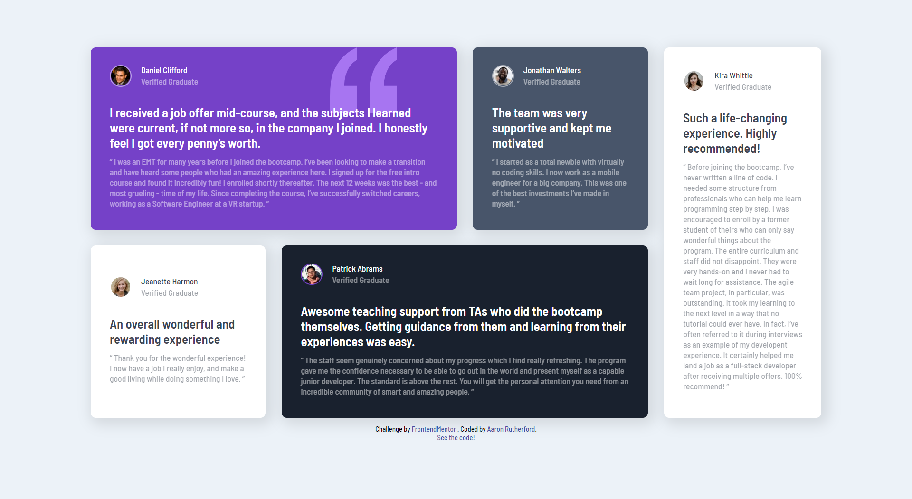

# Frontend Mentor - Testimonials grid section solution

This is a solution to the [Testimonials grid section challenge on Frontend Mentor](https://www.frontendmentor.io/challenges/testimonials-grid-section-Nnw6J7Un7). Frontend Mentor challenges help you improve your coding skills by building realistic projects. 

## Table of contents

- [Overview](#overview)
  - [The challenge](#the-challenge)
  - [Screenshot](#screenshot)
  - [Links](#links)
- [My process](#my-process)
  - [Built with](#built-with)
  - [What I learned](#what-i-learned)
  - [Continued development](#continued-development)
- [Author](#author)

## Overview

### The challenge

Users should be able to:

- View the optimal layout for the site depending on their device's screen size

### Screenshot

### Links

- Solution URL: [https://www.frontendmentor.io/solutions/responsive-testimonial-grid-vaNCYtmRZK](https://www.frontendmentor.io/solutions/responsive-testimonial-grid-vaNCYtmRZK)
- Live Site URL: [https://hazipan.github.io/testimonials-grid/](https://hazipan.github.io/testimonials-grid/)

## My process

### Built with

- Flexbox
- CSS Grid

### What I learned

I learned how to use grid-template-areas. I had never used it before and it was a real treat to use.

### Continued development

I need to improve my responsiveness and I want to try using SCSS. On my next project, I'm going to use SCSS.

## Author

- Github - [Hazipan](https://github.com/Hazipan)
- Frontend Mentor - [@Hazipan](https://www.frontendmentor.io/profile/hazipan)
